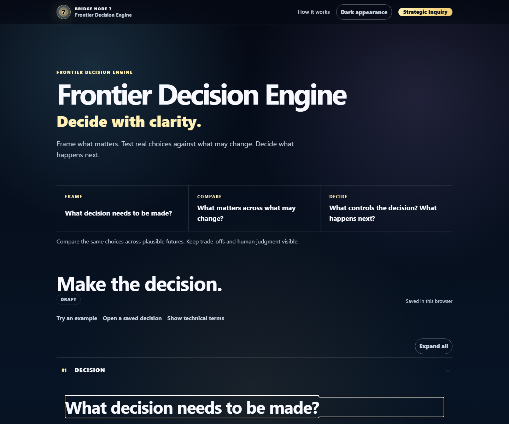

# Frontier Decision Engine

**Bring a messy situation. Find the decision. Test choices when useful. Keep the final judgment human-owned.**

[Open the live application](https://bridgenode7.com/frontier-decision-engine/)



## Start with Decision Rescue

Decision Rescue accepts ordinary language first. A visitor can put down what is happening, choose one useful next action, and build a Decision Frame without knowing decision-science terminology.

FDE preserves what the person confirms and does not pretend browser JavaScript inferred evidence, probabilities, thresholds, scores, or a recommendation. A partial Decision Frame is a valid stopping point.

Decision Rescue uses tab-scoped session storage so an accidental refresh can recover in-progress framing. It does not treat the original brain dump as model evidence. When a complete frame continues into the Decision Lab, existing browser-saved Lab work is never replaced without an explicit human choice.

## What the Decision Lab does

- Frames the decision, goals, choices, and plausible futures.
- Evaluates the same choices across explicit goals and named conditions.
- Shows unmet goals, ties, incomplete outcomes, and vulnerabilities.
- Keeps final selection, rationale, and next action human-owned.
- Exports a portable decision file and a readable decision summary.

Guided work supports 2–4 objectives, 2–3 choices, and 2–4 plausible futures. The minimum comparison is a real 2 × 2 × 2 model. FDE never fills missing analytical inputs on the person's behalf.

The included ready example is a **synthetic critical-material source-qualification case**. It does not describe or certify a real supplier, material, capacity, compliance status, or investment.

## Privacy and authority

The application is static and browser-local. It has no backend, account system, analytics, telemetry, cookies, or default upload endpoint.

Browser storage is a convenience, not encrypted confidential storage. Do not enter information that requires an approved confidential or controlled-data environment.

FDE provides decision support. It does not approve, authorize, certify, qualify, consent, or make an investment decision. The comparison informs; a person decides.

## Run locally

```bash
node scripts/run-python.mjs -m http.server 8000 --directory site
```

Open `http://localhost:8000`.

## Verify

Requirements: Node.js 22+, Python 3.11+, and Chromium or Google Chrome.

```bash
node scripts/run-python.mjs -m pip install -r requirements-dev.txt
node scripts/run-python.mjs -m playwright install chromium
npm ci --ignore-scripts --no-audit --no-fund
npm run check
```

`npm run check` runs the repository's unit, version, integrity, browser, Decision Rescue, and release-closeout gates. Current generated counts and versions are recorded in [`project-facts.json`](project-facts.json).

## Documentation

- [Architecture](docs/ARCHITECTURE.md)
- [Methodology](docs/METHODOLOGY.md)
- [Privacy](docs/PRIVACY.md)
- [Releases](docs/RELEASING.md)

## Project

Changes must preserve human decision authority, privacy, accessibility, and the complete validation gate. See [CONTRIBUTING.md](CONTRIBUTING.md).

Report vulnerabilities through GitHub private vulnerability reporting as described in [SECURITY.md](SECURITY.md).

Apache-2.0 licensed. See [LICENSE](LICENSE).
