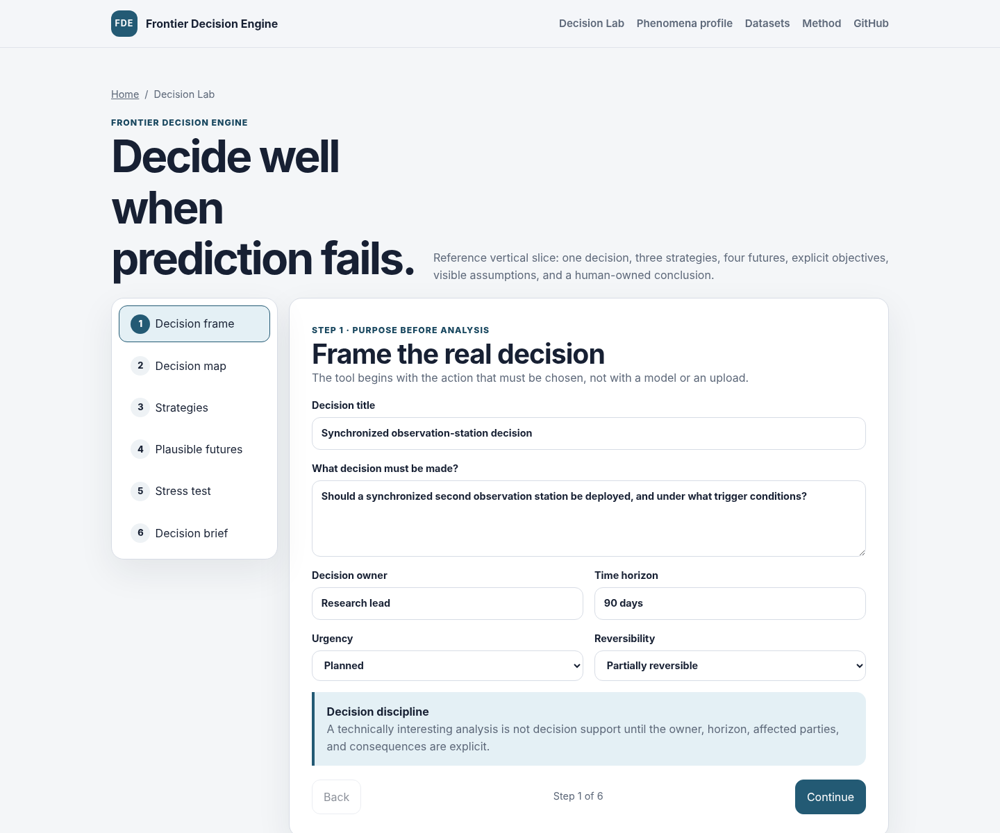

# Frontier Decision Engine

Browser-local, human-governed decision support for choices under deep uncertainty.

[Open the live application](https://bridgenode7.com/frontier-decision-engine/)



## What it does

- Frames decisions, objectives, uncertainties, strategies, and plausible futures.
- Evaluates choices across explicit goals and named future conditions.
- Shows unmet goals, ties, incomplete outcomes, and conditions to watch.
- Keeps final selection, rationale, and next action human-owned.
- Exports portable decision and evidence records.
The application is static and browser-local. It has no backend, account system,
analytics, cookies, or default upload endpoint.

## Ready reference case

The default public workflow uses a clearly labeled synthetic critical-material source-qualification case. It demonstrates the interface and does not certify a supplier, qualify a material, confirm production capacity, guarantee compliance, recommend an investment, or predict commodity prices.

The Decision Lab saves work in the local browser and supports decision-file download, reopen, and readable-summary export without an account or default upload endpoint.

## Run locally

```bash
python3 -m http.server 8000 --directory site
```

Open `http://localhost:8000`.

## Verify

Requirements: Node.js 22+, Python 3.11+, and Chromium or Google Chrome.

```bash
python3 -m pip install -r requirements-dev.txt
python3 -m playwright install chromium
npm ci --ignore-scripts --no-audit --no-fund
npm run check
```

Current generated counts and versions are recorded in
[`project-facts.json`](project-facts.json).

## Documentation

- [Architecture](docs/ARCHITECTURE.md)
- [Methodology](docs/METHODOLOGY.md)
- [Data](docs/DATA_DICTIONARY.md)
- [Privacy](docs/PRIVACY.md)
- [Releasing](docs/RELEASING.md)

## Project

Contributions must preserve evidence boundaries, human decision authority,
privacy, accessibility, and the complete validation gate. See
[CONTRIBUTING.md](CONTRIBUTING.md).

Report vulnerabilities through GitHub private vulnerability reporting as
described in [SECURITY.md](SECURITY.md).

Apache-2.0 licensed. See [LICENSE](LICENSE).
